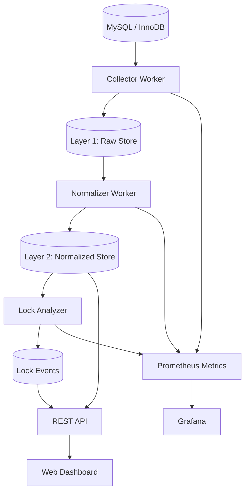

### Tổng quan kiến trúc

```mermaid
flowchart TD
    DB[(MySQL / InnoDB)]
    C[Collector Worker]
    RAW[(Layer 1: Raw Store)]
    N[Normalizer Worker]
    DOMAIN[(Layer 2: Normalized Store)]
    A[Lock Analyzer]
    EVENTS[(Lock Events)]
    API[REST API]
    UI[Web Dashboard]
    METRICS[Prometheus Metrics]
    G[Grafana]

    DB --> C
    C --> RAW
    RAW --> N
    N --> DOMAIN
    DOMAIN --> A
    A --> EVENTS
    DOMAIN --> API
    EVENTS --> API
    API --> UI
    C --> METRICS
    N --> METRICS
    A --> METRICS
    METRICS --> G
```
